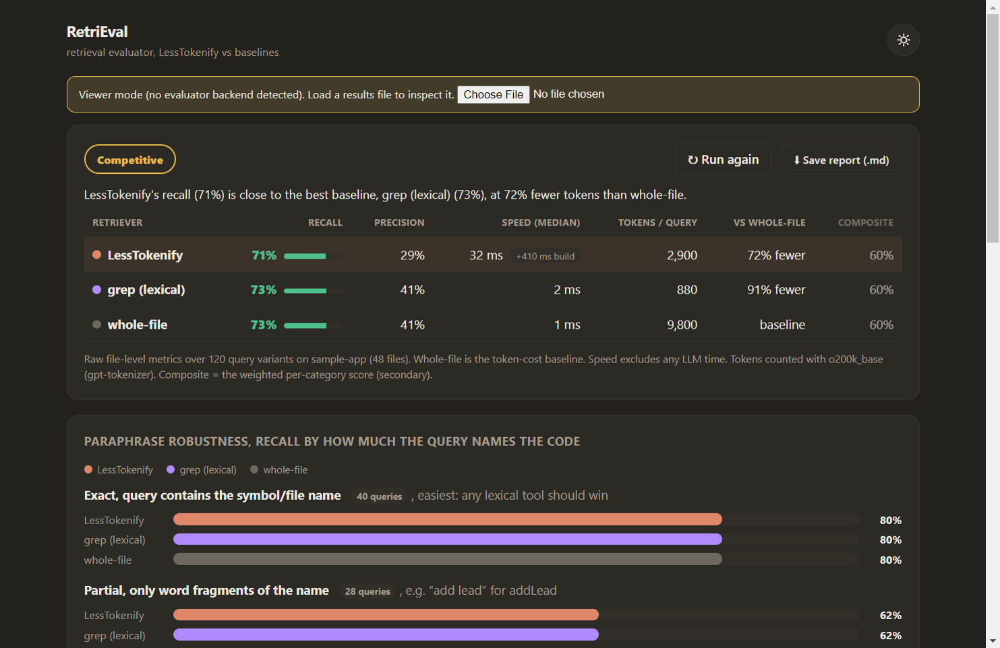

# RetriEval

**A neutral benchmark for code retrieval.** Point it at a TypeScript/JavaScript
repo and it answers one question, honestly: *when a developer asks "where's the
code that does X?", how well does a given retriever find the right files, and
what does it cost in tokens?*

Most "does my retrieval work?" answers are vibes. RetriEval turns them into
numbers you can defend: **recall, precision, latency, and real token counts**,
measured the same way for every contestant, against an answer key the retriever
never gets to see.



## Why this exists

If you're building anything that feeds code to an LLM, whether that's a RAG
pipeline, a "chat with your repo" tool, or an agent that greps around before it
edits, you are making a retrieval bet. Fetch too little and the model
hallucinates. Fetch too much and you pay for whole files you didn't need.
RetriEval is the ruler for that tradeoff, and it's deliberately built to have
**no favourite**: every retriever is graded by the same mechanical answer key, so
the tool can't flatter the one you happen to like.

It ships with two baselines that need nothing installed. **`grep (lexical)`** is
what an agent does when it just searches the repo, and **`whole-file`** is the
token-expensive "just read the files" approach. You plug your own retriever in
next to them.

> **LessTokenify** is one such retriever, a code-retrieval tool that tries to
> hand an agent the *relevant slices* of a repo instead of whole files. It's the
> reason RetriEval was originally built, but here it's just one contestant among
> others, and it has to earn its place on the same scoreboard as everyone else.

## What makes the numbers trustworthy

The whole design rests on one rule: **trust comes from where the *answer* comes
from, never the question.**

- **The answer key is mechanical.** A [ts-morph](https://ts-morph.com) static
  pass reads the repo and derives ground truth (symbol definitions, imports, the
  call graph, who-uses-what) with no LLM in the loop and no knowledge of any
  retriever. You can't overfit to an answer key you didn't write.
- **Paraphrase buckets keep it honest.** Questions are asked up to three ways:
  *exact* (names the symbol), *partial* (word fragments), and *none* (describes
  the behaviour, names nothing). That last bucket is the truth serum. It's where
  purely lexical retrieval falls apart, and where semantic approaches have to
  prove they're worth the cost.
- **Authorship is tracked and reported separately.** Questions can be
  human-written, mechanically generated, or LLM-authored, and RetriEval reports
  each stratum on its own line, plus a fairness metric, so an easy auto-generated
  question set can't quietly inflate a score.

## Quickstart

```bash
npm install
npm run eval /path/to/any/typescript-or-js/repo
```

That's it. No login, no API key, no private data. It copies the repo to a sandbox
(your code is never touched), builds the answer key, quizzes `grep` and
`whole-file`, and prints a scorecard plus a JSON report in `eval-results/`.

To put a real retriever in the ring, point RetriEval at it via
`RETRIEVAL_LT_RUNNER` (or write your own adapter; the interface is a single
function: `(repoRoot, query) -> { files, contextTokens }`). To force a
baseline-only run even when a retriever is installed, set `RETRIEVAL_NO_LT=1`.

There's also a desktop app (Electron) with a live dashboard: charts, the
paraphrase-robustness panel, and a "bring your own agent retriever" card that can
pit your own `claude`/`codex` against the baselines and stream what the agent is
doing as it searches.

## Scope (read this before judging it)

This is early, and honest about it:

- **TypeScript / JavaScript only.** The answer key is built with ts-morph. Other
  languages need their own analyzer.
- **The method is the product, not a leaderboard.** RetriEval is a way to
  *measure*; it ships no published rankings of anyone's tool.
- **CLI runs anywhere** (it's plain Node). The packaged desktop **`.exe` is
  Windows-only** for now, though the eval engine underneath is cross-platform.
- **Bring your own repo.** There's no bundled sample yet (planned); today you
  point it at code you already have.

## How it works

Every run executes a fixed pipeline against a sandboxed copy of the target repo,
so the original is never modified:

1. **Analyze.** A ts-morph static pass derives the mechanical answer key: symbol
   definitions, import edges, the call graph, and cross-file references.
2. **Author.** Questions are assembled from that answer key and tagged by source
   (human, generated, or model), then expanded into query variants that differ
   in how much they lexically overlap the code.
3. **Retrieve.** Each retriever runs against every variant, and every call is
   individually timed.
4. **Score.** Results are graded for file-level precision and recall, with real
   token counts recorded per query.
5. **Report.** Metrics are aggregated per retriever, per category, and per
   overlap bucket, followed by a fairness pass over question authorship.

## What's next

Planned for a future version:

- **A bundled sample repo**, so a fresh clone produces a score with zero setup and
  no need to bring your own code.
- **Git-history mining.** Turn real issues and their fix commits into questions
  whose answer is the set of files the fix actually touched, drawn straight from
  version control instead of generated.
- **A local, open-source question author.** Use a fully local model to write the
  human-style questions. That removes the CLI login requirement and the
  home-field bias that comes from letting a contestant's own model set the exam.
- **A vector-search baseline** alongside grep and whole-file, so embedding-based
  retrieval sits on the same scoreboard.
- **More languages.** The answer key is TypeScript and JavaScript only today;
  other languages need their own static-analysis pass.

## License

**Source-available under the [PolyForm Noncommercial License 1.0.0](LICENSE).**
Free to use, study, modify, and share for any **noncommercial** purpose: research,
learning, hobby projects, non-profits, education. **Commercial use is not
granted.** It's public so you can read it and build on the ideas; it is not open
source, and it is not a free pass to sell.
